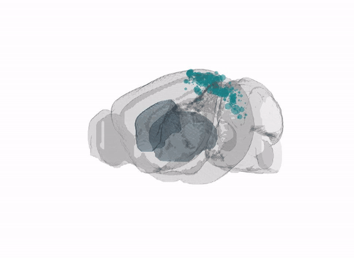
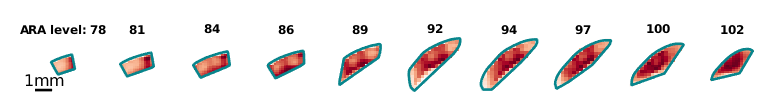
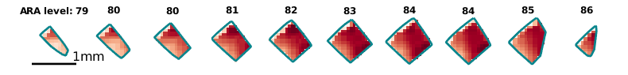
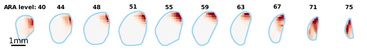

# Brain Street View 
Load and plot Allen Connectivity Data ([Oh et al., Nature, 2014](doi.org/10.1038/nature13186))

### 🏁 Quick start 

See the script `gettingStarted.mlx` to get started. The first time the script is run, it will be slow  because images need to be downloaded. In subsequent runs, these images will simply be loaded and it will be much faster. 

### ⚒️ Installation

BrainStreetView requires MATLAB>=2019a.

To begin using BrainStreetView:
- [clone](https://docs.github.com/en/repositories/creating-and-managing-repositories/cloning-a-repository) the [repository](https://github.com/Julie-Fabre/brain_street_view) and the [dependencies](#Dependencies).
- add BrainStreetView's and the dependancies' folders to [MATLAB's path](https://uk.mathworks.com/help/matlab/ref/pathtool.html).

Dependencies:
- [allenCCF](https://github.com/cortex-lab/allenCCF), to get Allen Atlas files
- [npy-matlab](https://github.com/kwikteam/npy-matlab), to read in .npy files
- [brewermap](https://github.com/DrosteEffect/BrewerMap), to generate colormaps
- [prettify-matlab](https://github.com/Julie-Fabre/prettify_matlab), to make plots pretty.

### 🖼️ Gallery 
 - projections from visual cortices to striatum: injection sites and striatum plotted in 3D

- example injections in primary visual cortex (VISp)

- example injections in antero-lateral visual cortex (VISal)

- projections from visual cortices (VIS) to striatum (CP)

### 🤗 Support and citing

If you find this repo useful in your work, we would like a citation [more details coming soon-ish]. Also, cite the Allen dataset: ([Oh et al., Nature, 2014](doi.org/10.1038/nature13186)). Cheers! 

### 📬 Contact me
If you run into any issues or if you have any suggestions, please raise a github issue, create a pull request or email me: [juliemfabre[at]gmail[dot]com](mailto:julie.mfabre@hmail.com).
