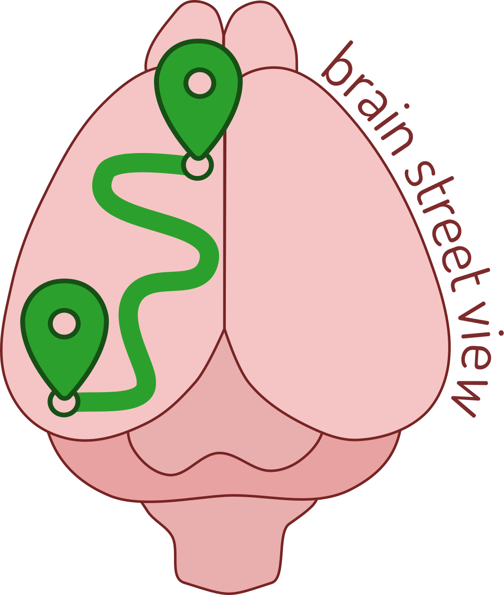
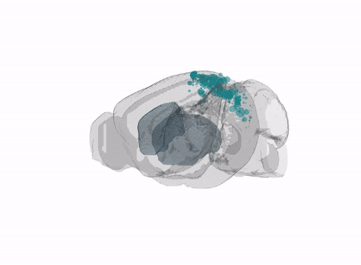
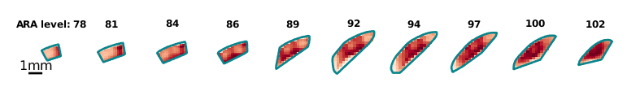
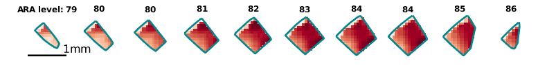
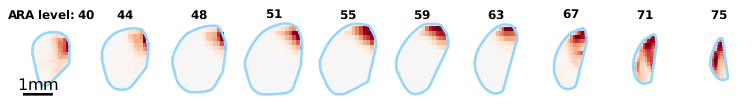

# Brain Street View 

[](https://pypi.org/project/brain-street-view/)
[](https://github.com/Julie-Fabre/brain_street_view/actions/workflows/tests.yml)
[](https://brain-street-view.readthedocs.io/en/latest/?badge=latest)
[](https://www.gnu.org/licenses/gpl-3.0)
[](https://pypi.org/project/brain-street-view/)
[]()

Load and plot Allen Connectivity Data ([Oh et al., Nature, 2014](https://doi.org/10.1038/nature13186))

Available in both **MATLAB** and **Python**. **[Documentation](https://brain-street-view.readthedocs.io)**

### 🏁 Quick start

**Python** (recommended):
```bash
pip install brain-street-view
```
Then open `example.ipynb` or run `example.py`. The first run downloads images from the Allen API and caches them locally. Subsequent runs load from cache.

**MATLAB**:
See the script `gettingStarted.mlx`. Requires MATLAB>=2019a.

### ⚒️ Installation

#### Python

```bash
pip install brain-street-view
```

Or from source:
```bash
git clone https://github.com/Julie-Fabre/brain_street_view.git
cd brain_street_view
pip install -e .
```

You also need the Allen CCF atlas files (not included):
- [allenCCF](https://github.com/cortex-lab/allenCCF) — annotation volumes and structure trees

#### MATLAB

- [Clone](https://docs.github.com/en/repositories/creating-and-managing-repositories/cloning-a-repository) the [repository](https://github.com/Julie-Fabre/brain_street_view) and the dependencies below.
- Add BrainStreetView's and the dependencies' folders to [MATLAB's path](https://uk.mathworks.com/help/matlab/ref/pathtool.html).

MATLAB dependencies:
- [allenCCF](https://github.com/cortex-lab/allenCCF), to get Allen Atlas files
- [npy-matlab](https://github.com/kwikteam/npy-matlab), to read in .npy files
- [brewermap](https://github.com/DrosteEffect/BrewerMap), to generate colormaps
- [prettify-matlab](https://github.com/Julie-Fabre/prettify_matlab), to make plots pretty.

### 📖 Usage

#### Python
```python
import bsv

# 1. Find experiments
experiment_ids = bsv.find_connectivity_experiments(['VISp', 'VISl'])

# 2. Fetch data
imgs, inj_summary, _, _ = bsv.fetch_connectivity_data(
    experiment_ids, '/path/to/cache', '',
    'injectionIntensity', False,
    allen_atlas_path='/path/to/allenCCF')

# 3. Plot projections to striatum
bsv.plot_connectivity(imgs, '/path/to/allenCCF', 'CP',
                       10, 15, 'coronal', True, 2, 'global', None,
                       'injectionIntensity')

# 4. 3D visualization
bsv.plot_connectivity_3d(inj_summary, '/path/to/allenCCF', 'CP',
                          plot_patch=True)
```

See `example.ipynb` for the full workflow including region grouping, thresholding, and CP subregion analysis.

#### MATLAB
```matlab
% 1. Find experiments
experimentIDs = bsv.findConnectivityExperiments({'VISp', 'VISl'});

% 2. Fetch data
[experimentImgs, injectionSummary] = bsv.fetchConnectivityData(experimentIDs, ...
    saveLocation, fileName, 'injectionIntensity', false, '', allenAtlasPath);

% 3. Plot
bsv.plotConnectivity(experimentImgs, allenAtlasPath, 'CP', 10, 15, ...
    'coronal', true, 2, 'global', [], 'injectionIntensity')
```

See `+bsv/example.m` for the full MATLAB workflow.

### 🖼️ Gallery
 - projections from visual cortices to striatum: injection sites and striatum plotted in 3D


- example injections in primary visual cortex (VISp)


- example injections in antero-lateral visual cortex (VISal)


- projections from visual cortices (VIS) to striatum (CP)



### 📬 Contact me
If you run into any issues or if you have any suggestions, please raise a github issue, create a pull request or email me: [juliemfabre[at]gmail[dot]com](mailto:juliemfabre@gmail.com).
