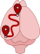

# Neuro Street View 
Load and plot Allen Connectivity Data ([Oh et al., Nature, 2014](doi.org/10.1038/nature13186))

### 🏁 Quick start 

See the script `nsv_example` to get started .

### ⚒️ Installation

Bombcell requires MATLAB>=2019a.

To begin using NeuroStreetView:
- [clone](https://docs.github.com/en/repositories/creating-and-managing-repositories/cloning-a-repository) the [repository](https://github.com/Julie-Fabre/bombcell/bombcell) and the [dependencies](#Dependencies).
- add NeuroStreetView's and the dependancies' folders to [MATLAB's path](https://uk.mathworks.com/help/matlab/ref/pathtool.html).

Dependencies:
- [allenCCF](https://github.com/cortex-lab/allenCCF)
- [prettify-matlab](https://github.com/Julie-Fabre/prettify_matlab), to make plots pretty.

### 🖼️ Gallery 

### 📬 Contact me
If you run into any issues or if you have any suggestions, please raise a github issu, create a pull request or email me: [juliemfabre[at]gmail[dot]com](mailto:julie.mfabre@hmail.com).

### Misc. 
Allen resources:
- https://allensdk.readthedocs.io/en/latest/unionizes.html 
- https://community.brain-map.org/t/api-allen-brain-connectivity/2988
- https://download.alleninstitute.org/informatics-archive/october-2014/mouse_projection/Accessing_October_2014_projection_data%20.pdf
