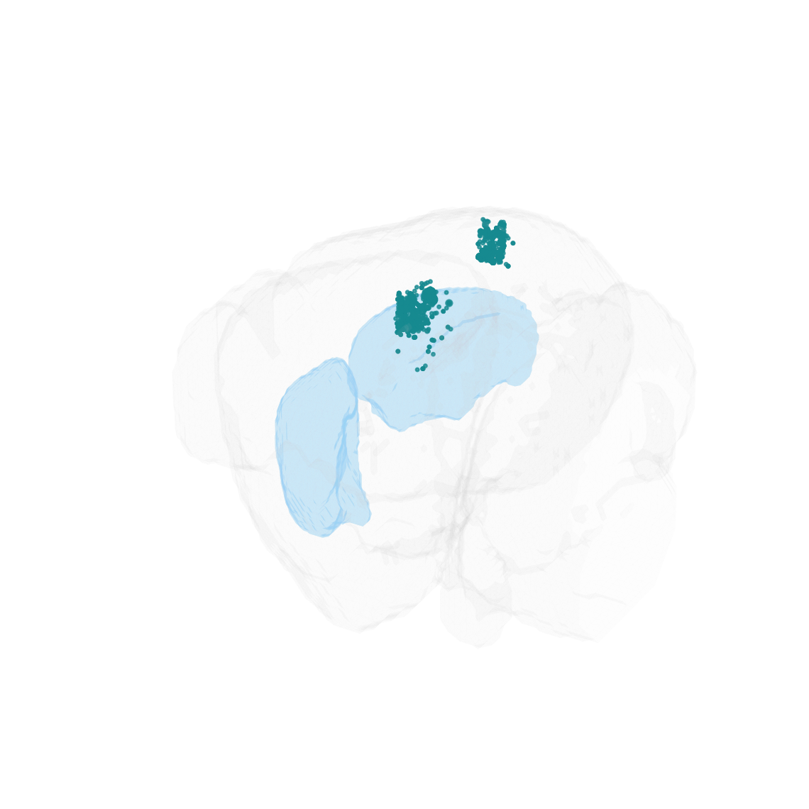

# Summary

Brain Street View (BSV) is a MATLAB and Python package for loading, visualizing, and analyzing data from the Allen Mouse Brain Connectivity Atlas [@Oh2014]. The Allen Connectivity Atlas is a widely used resource containing hundreds of anterograde tracing experiments that map mesoscale axonal projections across the mouse brain. BSV provides a streamlined pipeline to query experiments via the Allen Institute API, download and cache projection density maps, and produce publication-ready 2D and 3D visualizations of connectivity patterns. The package includes tools for normalizing data across experiments, thresholding projection signals, and performing quantitative subregion analyses---with particular support for projections to the striatum (caudate putamen and nucleus accumbens).

# Statement of need

The Allen Mouse Brain Connectivity Atlas [@Oh2014] is one of the most comprehensive resources for understanding mesoscale wiring in the mouse brain. However, working with this data requires navigating complex API queries, handling large volumetric image data, aligning data to standardized coordinate frameworks [@Wang2020], and producing clear visualizations---a process that involves substantial boilerplate code. While the Allen Institute provides a general-purpose Python SDK [@allensdk], and tools such as brainrender [@brainrender] offer powerful 3D visualization, there is a gap for a lightweight, focused tool that handles the full workflow from data retrieval to publication-quality figures of projection patterns to specific target regions.

BSV fills this gap by providing an end-to-end pipeline that:

- Queries the Allen API for connectivity experiments filtered by injection region, transgenic mouse line, and injection quality criteria.
- Downloads and caches projection density maps at multiple atlas resolutions (10 $\mu$m and 20 $\mu$m), avoiding redundant downloads.
- Generates 2D coronal and sagittal slice visualizations with region-of-interest masking, customizable colormaps, and multiple normalization strategies (injection intensity, per-region, z-score, robust scaling).
- Produces 3D isosurface renderings of projection patterns overlaid on atlas anatomy.
- Supports quantitative analysis of projections within anatomical subdivisions, including CSV export of per-region statistics.
- Offers multiple thresholding methods (absolute, percentile, z-score, relative) to identify significant projection signals.

BSV is aimed at systems neuroscientists who study circuit-level connectivity in the mouse brain and need to quickly retrieve, visualize, and compare projection data from the Allen Atlas. Its dual MATLAB/Python implementation makes it accessible to researchers across the two most common programming environments in neuroscience.

# State of the field

Several tools exist for working with Allen Brain Atlas data. The Allen SDK [@allensdk] provides comprehensive Python bindings for all Allen Institute APIs but requires users to write their own visualization and analysis code. brainrender [@brainrender] offers sophisticated 3D neuroanatomical visualization but focuses on rendering rather than the data retrieval and quantitative analysis pipeline. The BrainGlobe Atlas API [@brainglobe] provides a unified interface for accessing multiple brain atlases and integrates with tools for cell detection and registration, but does not include connectivity-specific retrieval or analysis workflows. The Janelia MouseLight project [@mouselight] offers single-neuron reconstructions and a complementary view of connectivity at the individual-cell level, rather than the population-level projection density maps provided by the Allen Atlas. Computational modeling approaches such as Knox et al. [@Knox2019] use connectivity data to build predictive models but do not provide visualization workflows. BSV is distinguished by its focus on the complete workflow from API query to publication-ready figure, its lightweight dependencies, its built-in support for striatal subregion analysis, and its availability in both MATLAB and Python.

# Software design

BSV is organized as a four-step pipeline:

1. **Experiment discovery**: `find_connectivity_experiments` queries the Allen API with filters for source region, transgenic line, and injection parameters, returning a list of experiment IDs.
2. **Data retrieval**: `fetch_connectivity_data` downloads projection density volumes for each experiment, caches them locally, and applies user-specified normalization. It supports multiple atlas resolutions and handles the coordinate transformations needed to align data across experiments.
3. **Visualization**: `plot_connectivity` generates 2D slice views with region masking, while `plot_connectivity_3d` produces 3D isosurface renderings. `plot_connectivity_multi_region` enables side-by-side comparison of projections from different source regions. `threshold_connectivity` applies signal thresholding using multiple statistical methods.
4. **Analysis**: `analyze_cp_subregions` decomposes projection signals into anatomical subdivisions of the caudate putamen and nucleus accumbens, producing per-slice and summary statistics with optional CSV export.

All functions accept extensive configuration through keyword arguments, allowing users to customize atlas resolution, normalization method, colormap, threshold strategy, and output format. Data downloaded from the Allen API is cached locally to avoid redundant network requests.

# Research impact statement

BSV has been used in published neuroscience research to visualize and analyze projection data from the Allen Connectivity Atlas. It was used in Pan-Vazquez et al. [@PanVazquez2025] to characterize dopaminergic projections from the ventral tegmental area to the striatum, in Song and Peters [@Song2025] to examine prefrontal cortex projections to the striatum during cross-modal sensorimotor learning, and in Piantadosi et al. [@Piantadosi2025] to visualize amygdala connectivity patterns in the context of risk-based decision making.

# AI usage disclosure

Claude Code (Anthropic) was used to assist with porting the original MATLAB codebase to Python and to help draft portions of this manuscript. All AI-generated code and text were reviewed and edited by the author.

# Acknowledgements

TODO_ACKNOWLEDGEMENTS

# References
